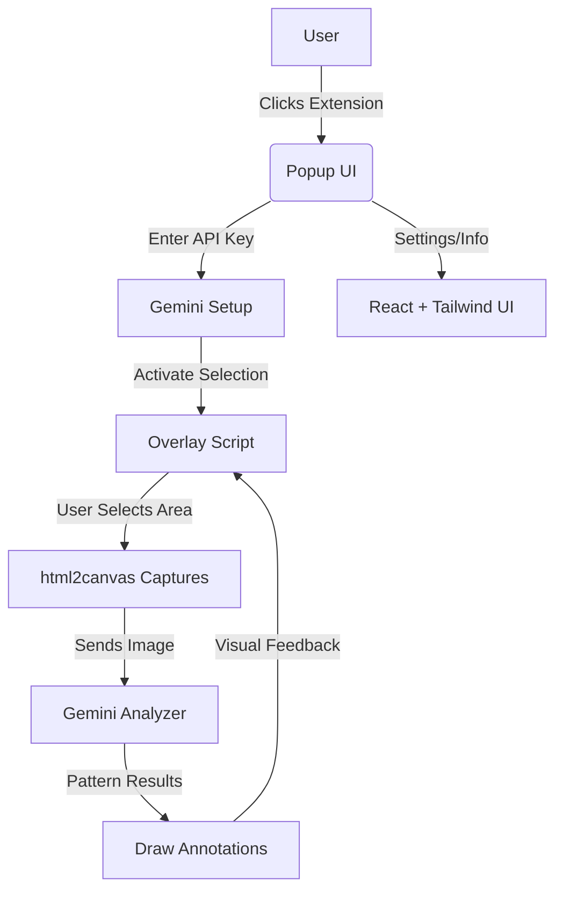

# TrendLens: Chart Pattern Detector Chrome Extension

> **Capture, analyze, and visualize chart patterns on any website using AI-powered computer vision.**

---

## 🚀 Features
- **Screen region capture** with interactive overlay selection
- **AI-powered chart pattern detection** using Gemini Vision API
- **Instant visual feedback** with smart annotations
- **Beautiful dark-themed UI** with Tailwind CSS
- **Modern React + TypeScript** architecture
- **Chrome Extension Manifest V3** compliance

---

## 🧩 Visual Architecture



---

## 📁 Project Structure

```
trend-lens/
│
├── manifest.json              # Chrome extension configuration
├── background.ts              # Service worker
├── content/
│   ├── overlay.ts            # Selection overlay + user interaction
│   ├── capture.ts            # Screen capture with html2canvas
│   ├── geminiAnalyzer.ts     # AI pattern detection
│   └── overlay.css           # Overlay styling
│
├── popup/
│   ├── index.html            # Popup HTML structure
│   ├── App.tsx               # React popup component
│   ├── main.tsx              # React entry point
│   └── tailwind.css          # Tailwind utility classes
│
├── utils/
│   └── drawAnnotations.ts    # Visual annotation rendering
│
├── public/
│   ├── icon.png              # Extension icon
│   └── vite.svg              # Vite logo
│
├── dist/                     # Built extension (generated)
├── package.json              # Dependencies & scripts
├── tsconfig.json             # TypeScript configuration
├── vite.config.ts            # Vite bundler config
├── build.js                  # Simple build script
└── build-extension.js        # Comprehensive build script
```

---

## ⚡ Quick Start

```bash
# 1. Clone the repository
git clone https://github.com/your-username/trend-lens.git
cd trend-lens

# 2. Install dependencies
npm install

# 3. Build the extension
npm run build:extension

# 4. Load in Chrome
#   - Navigate to chrome://extensions
#   - Enable "Developer mode" (top right)
#   - Click "Load unpacked" and select the `dist/` folder
#   - The TrendLens extension should now appear in your toolbar
```

---

## 🛠️ Development

### Build Scripts
- **`npm run build:extension`** - Complete production build
  - Cleans `dist/` directory
  - Compiles TypeScript to JavaScript
  - Builds React popup with Vite
  - Copies all assets and configuration
  - Verifies build integrity
  - Shows final folder structure

- **`npm run build`** - Simple TypeScript compilation
- **`npm run dev`** - TypeScript watch mode for development

### Build Output Structure
```
dist/
├── manifest.json
├── background.js
├── content/
│   ├── overlay.js
│   ├── overlay.css
│   ├── capture.js
│   └── geminiAnalyzer.js
├── popup/
│   ├── index.html
│   ├── popup.js              # Bundled React app
│   └── index.css             # Bundled Tailwind styles
├── utils/
│   └── drawAnnotations.js
├── icon.png
└── vite.svg
```

---

## 🎨 UI & Styling

### Tailwind CSS Integration
This extension uses **Tailwind CSS** for beautiful, responsive styling. The setup avoids Chrome extension CSP restrictions by using a local Tailwind file instead of CDN.

**Reference:** [Using Tailwind CSS in a Chrome Extension](https://harrisonbroadbent.com/blog/tailwind-in-chrome-extension/)

### Key UI Features
- **Dark gradient theme** (gray-900 to gray-800)
- **Responsive design** with proper width (384px)
- **Interactive animations** and hover effects
- **Professional icons** using Heroicons SVG
- **Gradient text effects** for branding
- **Form validation** with visual feedback

### Popup States
1. **API Key Setup** - Beautiful onboarding for Gemini API key
2. **Ready State** - Main interface with chart analysis button
3. **Loading State** - Smooth loading animations

---

## 🔧 Technical Details

### Chrome Extension Architecture
- **Manifest V3** compliance
- **Service Worker** background script
- **Content Scripts** for page interaction
- **Popup UI** with React components
- **Storage API** for secure API key storage

### AI Integration
- **Gemini Vision API** for image analysis
- **Chart pattern recognition** with computer vision
- **Secure API key storage** in Chrome's local storage
- **Error handling** and validation

### Build Process
1. **TypeScript Compilation** - All `.ts` files → `.js`
2. **React Bundling** - Vite bundles popup with dependencies
3. **Asset Copying** - Manifest, icons, and CSS files
4. **Tailwind Processing** - CSS utilities bundled with Vite
5. **Verification** - Ensures all required files are present

---

## 🧪 Testing & Debugging

### Chrome Extension Testing
1. Build the extension: `npm run build:extension`
2. Load `dist/` folder in Chrome extensions
3. Test popup functionality and API key setup
4. Test overlay selection on any webpage
5. Verify Gemini API integration

### Common Issues & Solutions
- **"Could not load JavaScript" errors**: Run build script to compile TypeScript
- **Tailwind styles not applying**: Check CSS import in `main.tsx`
- **API key not saving**: Verify Chrome storage permissions
- **Overlay not appearing**: Check content script injection

### Debug Tools
- **Chrome DevTools** for popup debugging
- **Extension console** at `chrome://extensions`
- **Network tab** for API call monitoring
- **TypeScript compiler** for type checking

---

## 🏗️ Tech Stack

### Frontend
- **React 18** - Modern UI library
- **TypeScript** - Type safety and better DX
- **Tailwind CSS** - Utility-first styling
- **Vite** - Fast build tool and bundler

### Browser APIs
- **Chrome Extensions API** - Extension lifecycle
- **Chrome Storage API** - Secure data storage
- **Chrome Scripting API** - Content script injection
- **html2canvas** - Screen capture functionality

### AI & Analysis
- **Google Gemini Vision API** - Image analysis
- **Chart pattern recognition** - AI-powered detection
- **Visual annotation system** - Result visualization

---

## 📝 Configuration

### Environment Setup
1. **Gemini API Key** - Get from [Google AI Studio](https://makersuite.google.com/app/apikey)
2. **Chrome Developer Mode** - Enable in `chrome://extensions`
3. **Node.js** - Version 16+ recommended

### API Key Setup
1. Open the extension popup
2. Enter your Gemini API key
3. Key is stored securely in Chrome's local storage
4. Click "Start Chart Analysis" to begin

---

## 🔐 Security & Privacy

### Data Handling
- **Local Storage Only** - API keys never leave your browser
- **No Data Collection** - Extension doesn't track user data
- **Secure API Calls** - Direct connection to Gemini API
- **No External Dependencies** - All assets bundled locally

### Permissions
- **activeTab** - Access current tab for screen capture
- **scripting** - Inject content scripts for overlay
- **storage** - Store API key securely

---

## 🤝 Contributing

### Development Setup
1. Fork the repository
2. Create a feature branch: `git checkout -b feature/amazing-feature`
3. Make your changes and test thoroughly
4. Run the build: `npm run build:extension`
5. Test the extension in Chrome
6. Commit your changes: `git commit -m 'Add amazing feature'`
7. Push to the branch: `git push origin feature/amazing-feature`
8. Open a Pull Request

### Code Style
- **TypeScript** for all new code
- **React functional components** with hooks
- **Tailwind CSS** for styling
- **ESLint** for code quality

---

## 📄 License

[MIT](LICENSE) - Feel free to use this project for personal or commercial purposes.

---

## 🙏 Acknowledgments

- **Tailwind CSS Chrome Extension Setup** - [Harrison Broadbent's Guide](https://harrisonbroadbent.com/blog/tailwind-in-chrome-extension/)
- **Google Gemini API** - AI-powered image analysis
- **html2canvas** - Screen capture functionality
- **React & Vite** - Modern development tools

---

## 📞 Support

If you encounter any issues or have questions:
1. Check the [troubleshooting section](#-testing--debugging)
2. Review the [Chrome extension documentation](https://developer.chrome.com/docs/extensions/)
3. Open an issue on GitHub with detailed information

---

**Happy chart analyzing! 📊✨**
