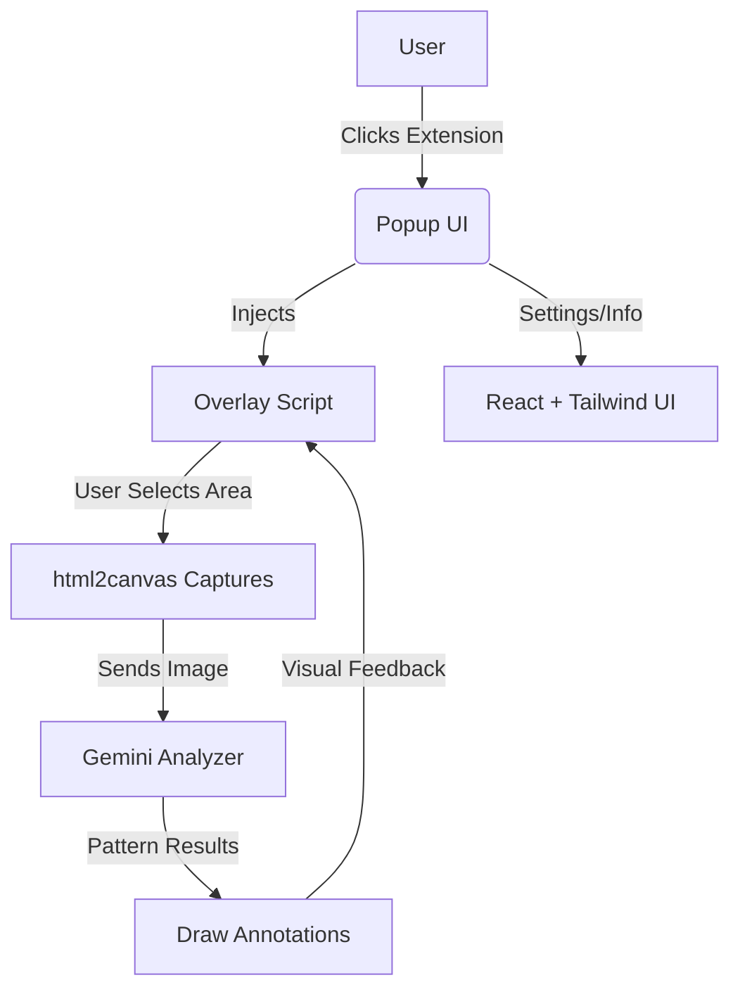

# TrendLens: Chart Pattern Detector Chrome Extension

> **Capture, analyze, and visualize chart patterns on any website using AI.**

---

## 🚀 Features
- **Screen region capture** with overlay selection
- **AI-powered chart pattern detection** (Gemini integration)
- **Instant visual feedback** with annotations
- **Modern React + TypeScript**
- **Easy Chrome extension packaging**

---

## 🧩 Visual Architecture



---

## 📁 Folder Structure

```
trend-lens/
│
├── manifest.json
├── background.ts
├── content/
│ ├── overlay.ts      // Handles selection + canvas overlay
│ ├── capture.ts      // Captures selected image
│ └── geminiAnalyzer.ts // Talks to Gemini Vision
│
├── popup/
│ ├── index.html      // Popup HTML
│ └── App.tsx         // Popup UI with "Activate Selection" button
├── utils/
│ └── drawAnnotations.ts // For adding visual overlays
├── public/
│ └── icon.png
├── package.json
├── tsconfig.json
└── build.js
```

---

## ⚡ Quick Start

```sh
# 1. Clone the repo
$ git clone https://github.com/your-username/trend-lens.git
$ cd trend-lens

# 2. Install dependencies
$ npm install

# 3. Build the extension
$ npm run build

# 4. Load in Chrome
#   - Go to chrome://extensions
#   - Enable "Developer mode"
#   - Click "Load unpacked" and select the `dist` folder
```

---

## 🛠️ Development
- **Build extension:** `npm run build` (outputs to `dist/`)
- **Watch mode:** `npm run dev` (TypeScript compilation in watch mode)

---

## 🧪 Chrome Extension Testing
- All TypeScript files are compiled to JavaScript in the `dist/` folder
- The build script copies `manifest.json`, popup HTML, and public assets
- Test the extension by loading the `dist/` folder in Chrome as an unpacked extension

---

## 🏗️ Tech Stack
- **TypeScript** (for type safety)
- **React 18** (for popup UI)
- **html2canvas** (for screen capture)
- **Chrome Extension Manifest V3**

---

## 📝 File Descriptions

### Core Files
- `manifest.json` - Chrome extension configuration
- `background.ts` - Service worker for extension lifecycle
- `build.js` - Build script to compile and package extension

### Content Scripts
- `content/overlay.ts` - Creates selection overlay and handles user interaction
- `content/capture.ts` - Captures selected screen region using html2canvas
- `content/geminiAnalyzer.ts` - AI integration for pattern detection

### Popup
- `popup/index.html` - Popup HTML structure
- `popup/App.tsx` - React component for popup UI

### Utilities
- `utils/drawAnnotations.ts` - Renders pattern annotations on screen

---

## 🤝 Contributing
Pull requests are welcome! For major changes, please open an issue first to discuss what you would like to change.

---

## 📄 License
[MIT](LICENSE)
