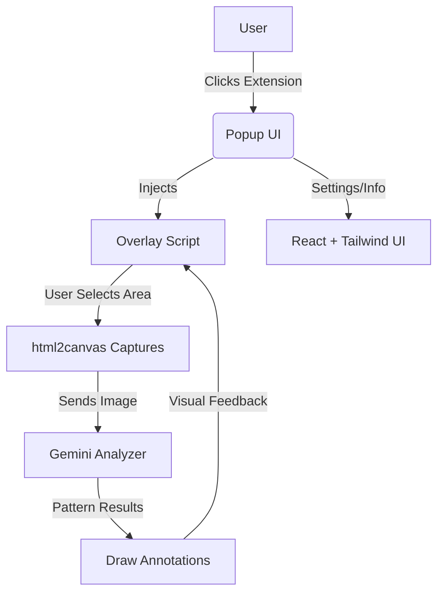

# TrendLens: Chart Pattern Detector Chrome Extension

> **Capture, analyze, and visualize chart patterns on any website using AI.**

---

## 🚀 Features
- **Screen region capture** with overlay selection
- **AI-powered chart pattern detection** (Gemini integration)
- **Instant visual feedback** with annotations
- **Modern React + TypeScript**
- **Easy Chrome extension packaging**

---

## 🧩 Visual Architecture



---

## 📁 Folder Structure

```
trend-lens/
│
├── manifest.json
├── background.ts
├── content/
│ ├── overlay.ts      // Handles selection + canvas overlay
│ ├── capture.ts      // Captures selected image
│ └── geminiAnalyzer.ts // Talks to Gemini Vision
│
├── popup/
│ ├── index.html      // Popup HTML
│ └── App.tsx         // Popup UI with "Activate Selection" button
├── utils/
│ └── drawAnnotations.ts // For adding visual overlays
├── public/
│ └── icon.png
├── package.json
├── tsconfig.json
├── build.js          // Simple build script
└── build-extension.js // Comprehensive build script
```

---

## ⚡ Quick Start

```sh
# 1. Clone the repo
$ git clone https://github.com/your-username/trend-lens.git
$ cd trend-lens

# 2. Install dependencies
$ npm install

# 3. Build the extension (comprehensive build)
$ npm run build:extension

# 4. Load in Chrome
#   - Go to chrome://extensions
#   - Enable "Developer mode"
#   - Click "Load unpacked" and select the `dist` folder
```

---

## 🛠️ Development

### Build Scripts
- **`npm run build:extension`** - Complete build process with verification
  - Cleans dist directory
  - Compiles TypeScript to JavaScript
  - Copies all necessary files
  - Verifies build output
  - Shows final folder structure
- **`npm run build`** - Simple build (legacy)
- **`npm run dev`** - TypeScript compilation in watch mode

### Build Output
After running `npm run build:extension`, your `dist/` folder will contain:
```
dist/
├── manifest.json
├── background.js
├── content/
│   ├── overlay.js
│   ├── capture.js
│   └── geminiAnalyzer.js
├── popup/
│   ├── index.html
│   └── App.js
├── utils/
│   └── drawAnnotations.js
└── public/
    └── icon.png
```

---

## 🧪 Chrome Extension Testing
- All TypeScript files are compiled to JavaScript in the `dist/` folder
- The build script copies `manifest.json`, popup HTML, and public assets
- Test the extension by loading the `dist/` folder in Chrome as an unpacked extension
- The build process verifies all required files are present

---

## 🏗️ Tech Stack
- **TypeScript** (for type safety)
- **React 18** (for popup UI)
- **html2canvas** (for screen capture)
- **Chrome Extension Manifest V3**

---

## 📝 File Descriptions

### Core Files
- `manifest.json` - Chrome extension configuration
- `background.ts` - Service worker for extension lifecycle
- `build-extension.js` - Comprehensive build script with verification

### Content Scripts
- `content/overlay.ts` - Creates selection overlay and handles user interaction
- `content/capture.ts` - Captures selected screen region using html2canvas
- `content/geminiAnalyzer.ts` - AI integration for pattern detection

### Popup
- `popup/index.html` - Popup HTML structure
- `popup/App.tsx` - React component for popup UI

### Utilities
- `utils/drawAnnotations.ts` - Renders pattern annotations on screen

---

## 🔧 Troubleshooting

### Common Issues
1. **"Could not load JavaScript" errors** - Run `npm run build:extension` to ensure all files are compiled
2. **Missing files in dist/** - The build script will verify and report any missing files
3. **TypeScript compilation errors** - Check your TypeScript code for syntax errors

### Build Verification
The `build:extension` script automatically verifies that all required files are present:
- ✅ manifest.json
- ✅ background.js
- ✅ content/overlay.js
- ✅ content/capture.js
- ✅ content/geminiAnalyzer.js
- ✅ popup/index.html
- ✅ popup/App.js
- ✅ utils/drawAnnotations.js

---

## 🤝 Contributing
Pull requests are welcome! For major changes, please open an issue first to discuss what you would like to change.

---

## 📄 License
[MIT](LICENSE)
